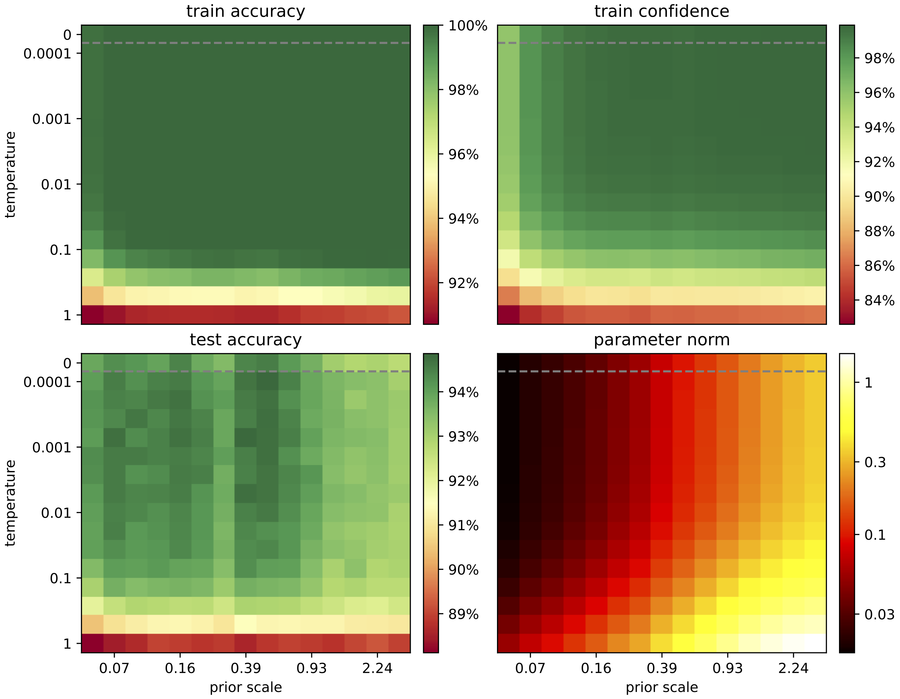
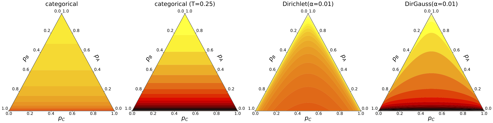
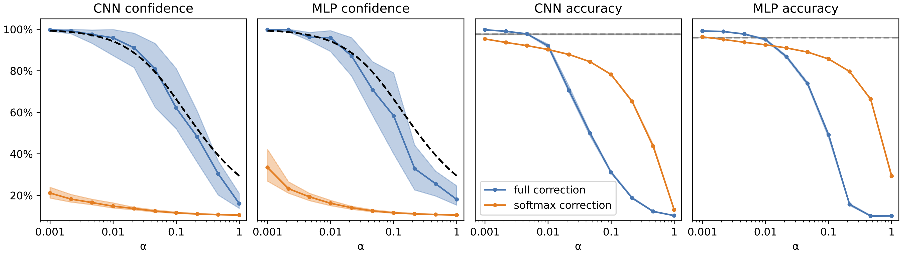

# Functional Priors and Cold Posteriors

This repository hosts the code to reproduce all results presented in the report *On Functional Priors and Cold Posteriors in Bayesian Neural Networks*.

# Key contributions

We reproduce the cold posterior effect on ResNet20+CIFAR10 with data augmentation turned on. Observe that training accuracy, training confidence, and test accuracy are all closely correlated.

This raises the question: could we obtain a a confident model at $T=1$ simply by using a prior that *forces* the model to be confident? [Kapoor el al.](https://arxiv.org/abs/2203.16481) have proposed to achieve this using a Dirichlet prior. However, we show their implementation only works beacuse it is inaccurate and secretly approximates a cold posterior. If it were accurate, it would not converge.

We demonstrate that correctly sampling from a prior distribution over model outputs requires a ``change of variables'' term that has not been previously discussed. Using a novel approximation for this term, we are able to control the confidence of a BNN, closely matching the expected confidence of a Dirichlet prior.

# File structure

The core[core] directory contains all the required code for sampling models. The [run.py](core/run.py) script provides a simple interface for sampling a single model.

All figures in the report were generated using the provided [Jupyter notebooks](notebooks).

The [experiments](experiments) directory contains two Python scripts: one for reproducing the cold posterior experiment (Figure 2.2), one for reproducing the Dirichlet prior experiment (Figure 5.1). While these two scripts are capable of fully reproducing our results, they are meant to serve mostly as pseudocode: they're very readable but you might find it necessary to add some experiment-management code to run multiple jobs in parallel, monitor them, etc. Since reproducing these experiments would take thousands of TPU-core hours, we also provide download links for model weights and training logs for the [cold posterior experiment](https://pub-e8bbdcbe8f6243b2a9933704a9b1d8bc.r2.dev/weights/bnn-dirichlet/resnet_cold.zip) (25 GB) and the [Dirichlet prior experiment](https://pub-e8bbdcbe8f6243b2a9933704a9b1d8bc.r2.dev/weights/bnn-dirichlet/mnist_dirichlet.zip) (1.9 GB).
